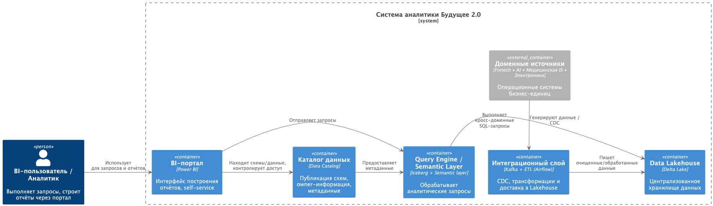

## С4 диаграмма контейнеров

---

## Проблемные места
| № | Проблема                                                            | Объяснение для бизнеса                                                                                     |
|---|---------------------------------------------------------------------|------------------------------------------------------------------------------------------------------------|
| 1 | Устаревший DWH на SQL Server 2008                                   | Сложно масштабировать, медленно работает, дорого поддерживать, нельзя эффективно разделить ответственность |
| 2 | Сложность построения отчётов (часы ожидания)                        | Аналитики и руководители не могут оперативно принимать решения                                             |
| 3 | Зашитая бизнес-логика в DWH                                         | Каждый новый бизнес требует доработки DWH, что замедляет развитие и дорого стоит                           |
| 4 | Слабая масштабируемость BI                                          | Нельзя быстро подключать новых пользователей или новые срезы данных                                        |
| 5 | Устаревшая интеграционная шина (Apache Camel)                       | Медленно, сложно развивать, нет масштабируемости                                                           |
| 6 | Отсутствие роли «владельца данных» в доменах                        | Нет ответственности за качество и актуальность данных                                                      |
| 7 | Использование медицинских данных в незащищённой аналитической среде | Риски нарушения законодательства по персональным и медицинским данным                                      |

---

## Приоритизация проблем
| Приоритет  | Проблема                         | Комментарий                                                                                                                                                                                                           |
|------------|----------------------------------|-----------------------------------------------------------------------------------------------------------------------------------------------------------------------------------------------------------------------|
| **Must**   | Устаревший DWH (SQL Server 2008) | Это критическая проблема, мешающая как текущей аналитике, так и масштабированию на новые бизнес-направления. Используемая версия больше не поддерживается, тормозит работу, и в неё сложно добавлять новую логику.    |
| **Must**   | Сложность построения отчётов     | Низкая скорость получения аналитики снижает бизнес-ценность данных. Это напрямую влияет на принятие решений.                                                                                                          |
| **Must**   | Бизнес-логика в DWH              | Прямые зависимости между доменами мешают гибкости и масштабированию. Архитектура должна обеспечивать слабую связанность, иначе внедрение новых бизнесов будет дорогим и долгим.                                       |
| **Should** | Устаревшая интеграционная шина   | Работает, но вызывает технические сложности и не масштабируется. Можно оставить временно, но нужно планировать переход на Kafka или другой современный брокер/ETL-инструмент.                                         |
| **Should** | Отсутствие владельцев данных     | Без четко определенных владельцев данных сложно масштабировать аналитику и обеспечить контроль доступа. У сотрудников нет прозрачности — откуда данные и что они значат. Это замедляет работу и повышает риск ошибок. |
| **Could**  | Ограничения BI-системы           | Важная часть видения финального решения. Пока это не устранено, аналитика — ручная работа и запросы в ИТ. Однако можно постепенно внедрять витрину, пока реализуются базовые слои.                                    |
| **Won’t**  | Медицинские данные в аналитике   | Не включаются в проект «витрина данных», вынесены в отдельную среду                                                                                                                                                   |