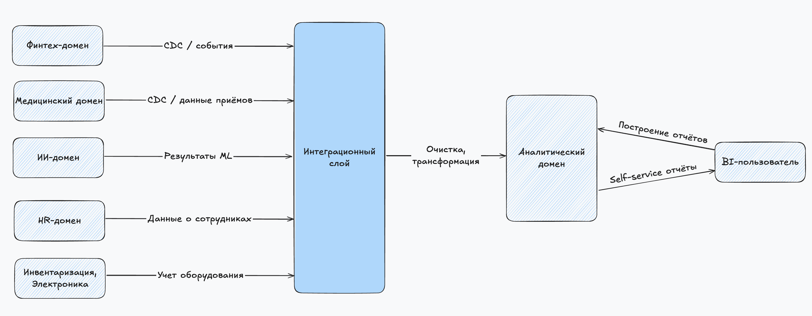

## 1. Разделение на домены

Мы делим систему "Будущее 2.0" по бизнес и технологическим границам, чтобы:
- обеспечить независимое развитие бизнесов,
- устранить зависимость от монолитного DWH,
- подготовить архитектуру к Data Mesh подходу.

| Домен                 | Назначение                                                                 |
|-----------------------|----------------------------------------------------------------------------|
| Финтех-домен          | Все, что связано с банковскими продуктами: кредиты, счета, транзакции      |
| Медицинский домен     | Информация о клиентах, врачах, расписаниях, приёмах и клинических данных   |
| ИИ-домен              | Модели ML/AI, диагностические подсказки, результаты обработки исследований |
| Электроника/Инвентарь | Учет оборудования, расходников, поставки                                   |
| HR-домен              | Персонал, зарплаты, графики, роли, доступы                                 |
| Аналитический домен   | Витрина данных, семантический слой, BI-портал                              |
| Интеграционный домен  | Kafka, Airflow/dbt, CDC из legacy-систем, каталог метаданных               |

---

## 2. Аргументация логики разделения на домены
| Аргумент                                  | Обоснование                                                                                                                           |
|-------------------------------------------|---------------------------------------------------------------------------------------------------------------------------------------|
| Независимость бизнес-направлений          | Банковские, медицинские, AI-направления развиваются независимо. Домены позволяют выпускать фичи без риска задеть других.              |
| Удаление логики из DWH                    | DWH больше не «бутылочное горлышко». Логика расчётов, трансформаций, агрегаций уходит в независимые пайплайны.                        |
| Data Mesh-подход                          | Каждый домен - владелец своих данных. Он публикует их через интеграционный слой в Lakehouse. Повышается качество и понятность данных. |
| Масштабируемость                          | Каждый домен можно разрабатывать, тестировать и масштабировать независимо, включая команды, CI/CD, SLA.                               |
| Упрощение безопасности и контроля доступа | Доступ настраивается отдельно: BI-пользователи не видят медицинские карты, ИИ не видит финансовые данные и т.д.                       |
| Гибкость в технологиях                    | Финтех может использовать PostgreSQL + Kafka, AI - Python + MLFlow, HR - готовую SaaS-систему. Нет жёсткой зависимости от SQL Server. |

---

## 3. DFD - отображение потоков данных между доменами
