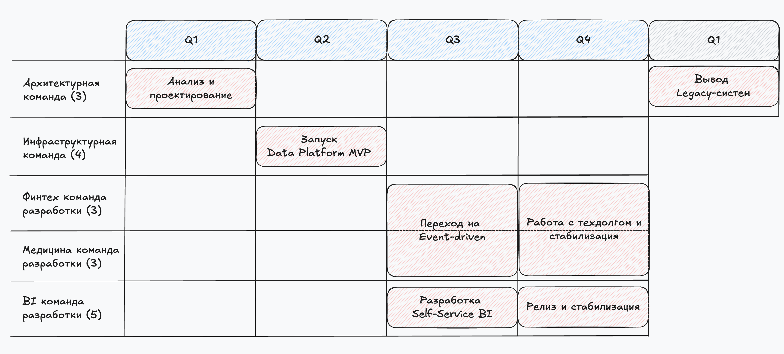

## 1. Технический радар

| Категория               | Adopt                                      | Trial                     | Assess             | Hold                                                      |
|-------------------------|--------------------------------------------|---------------------------|--------------------|-----------------------------------------------------------|
| **Языки и Фреймворки**  | Java, Python, Golang, Airflow, Spring Boot | TypeScript, Kotlin        | Rust               | PowerBuilder                                              |
| **Платформы**           | Kafka, Postgres, ClickHouse, S3            | MinIO, Snowflake          | Iceberg, Istio     | Apache Camel, SQL Server 2008                             |
| **Практики и Паттерны** | Domain-Driven Design, OAuth2/OpenID, RBAC  | ABAC                      | Data Mesh          | Монолитная архитектура данных,  Нет разграничения доступа |
| **Инструменты**         | Prometheus, Grafana, Loki, GitLab CI/CD    | Apache Superset, Metabase | GraphQL Federation | SOAP/XML                                                  |

---

## 2. Роадмап

### Результаты Q1
  - Построена модель контекстов C4.
  - Построены DFD-диаграммы.
  - Сформулированы независимые домены, определены владельцы данных.
  - Подготовлено техническое задание на MVP Data Platform.

### Результаты Q2
  - Развёрнут Kafka-кластер.
  - Хранилище DWH на ClickHouse.
  - Первая витрина данных.
  - CI/CD пайплайн для загрузки и трансформаций.
  - Мониторинг и алерты для Kafka и DWH.

### Результаты Q3
  - Описаны схемы событийных контрактов.
  - Публикация бизнес-событий в Kafka.
  - Бизнес-сервисы адаптированы к потоковой публикации.
  - Разработан web-интерфейс Self-Service BI портала.
  - Power BI отчёты подключены к витринам.
  - Запущен Data Catalog с описанием витрин, lineage, владельцев

### Результаты Q4
  - Проведен аудит и рефакторинг временных решений.
  - Конфигурация Kafka оптимизирована под текущую нагрузку.
  - Релиз состоялся. Инфраструктура и код стабилизированы.

### Результаты Q1 (Следующий год)
  - Отключён SQL Server 2008.
  - Вывод PowerBuilder-приложений.
  - Аудит отсутствия обращений к старым источникам данных за последний квартал.

---

## 3. Обоснование изменений

1. **Анализ и проектирование**.  
Перед переходом к построению масштабируемой, событийно-ориентированной архитектуры необходимо чётко определить границы доменов, источники и потребители данных, и точки интеграции. Диаграммы C4, DFD, описание доменов - создают единое понимание системы у команд и бизнес-стейкхолдеров. Это снижает риски несогласованной разработки и дорогостоящих переделок на следующих этапах.

2. **Запуск Data Platform MVP**.  
На раннем этапе критически важно построить минимально жизнеспособную платформу для работы с данными - Data Platform MVP, включающую Kafka, хранилище аналитических данных, базовую витрину и инструменты оркестрации. Это создаёт фундамент для потоковой и пакетной аналитики, упрощает построение BI и позволяет начать миграцию от ручных отчётов и монолитного DWH.

3. **Переход на Event-driven интеграцию**.  
Чтобы обеспечить масштабируемость и слабую связанность доменов, необходимо перейти от REST-интеграций и ручных ETL к событийной модели взаимодействия. Публикация бизнес-событий позволяет командам независимо развивать сервисы, упрощает реализацию реактивных сценариев и формирует основу для real-time аналитики.

4. **Разработка Self-Service BI**.  
Целью данного этапа является сокращение зависимости бизнеса от аналитиков и инженеров при получении данных. Через портал самообслуживания BI и интеграцию с Power BI, пользователи смогут самостоятельно находить нужные источники, строить отчёты и дашборды. Это увеличивает гибкость, скорость принятия решений и прозрачность данных.

5. **Работа с техническим долгом и стабилизация.**  
Переход на событийную архитектуру требует времени на стабилизацию процессов, устранение временных решений и выстраивание надёжных паттернов работы с событиями. Без этого технический долг может затруднить масштабирование и сопровождение системы.

6. **Вывод Legacy-систем**  
Завершение перехода к новой архитектуре требует планомерного отключения устаревших компонентов, таких как SQL Server 2008, PowerBuilder и ручные ETL-скрипты. Эти компоненты тормозят развитие, создают риски безопасности, не поддерживают новые модели данных и усложняют DevOps. Освобождение от легаси снижает стоимость сопровождения и повышает надёжность.